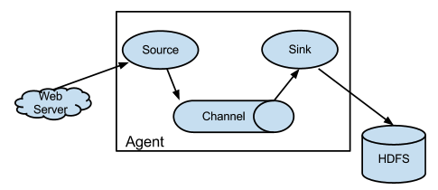

# Flume

架构图

重要概念：
A Flume event is defined as a unit of data flow having a byte payload and an optional set of string attributes.
Flume agent
Source:
Channel: The channel is a passive store that keeps the event until it’s consumed by a Flume sink. 文件系统就是一种Channel;
Sink:
Recoverability：
The events are staged in the channel, which manages recovery from failure
基于本地文件系统的Channel，可恢复；
基于内存的Channel，当agent进程挂掉后，不可恢复；

## Flume 拦截器
Flume能够实时修改/删除事件。 这是在拦截器的帮助下完成的。 拦截器是实现org.apache.flume.interceptor.Interceptor接口的类。 拦截器可以根据拦截器开发人员选择的任何标准来修改甚至删除事件。 Flume支持拦截器链接。 通过在配置中指定拦截器生成器类名称的列表，可以实现此目的。 拦截器在源配置中指定为用空格分隔的列表。 指定拦截器的顺序就是调用它们的顺序。 由一个拦截器返回的事件列表将传递到链中的下一个拦截器。 拦截器可以修改或删除事件。 如果拦截器需要删除事件，它只是不在返回的列表中返回该事件。

Timestamp Interceptor
该拦截器会将Event的处理时间（以毫秒为单位）插入到Event的Header中。 此拦截器将在Event Header中插入一个Key为timestamp（或者由headerName属性值确定），Value为响应的时间戳。 如果Event Header已经存在，可以通过preserveExisting配置是否覆盖。

Host Interceptor
此拦截器插入运行此代理的主机的主机名或IP地址

Static Interceptor
静态拦截器允许用户拼接一个静态的header

Remove Header Interceptor
该拦截器可以